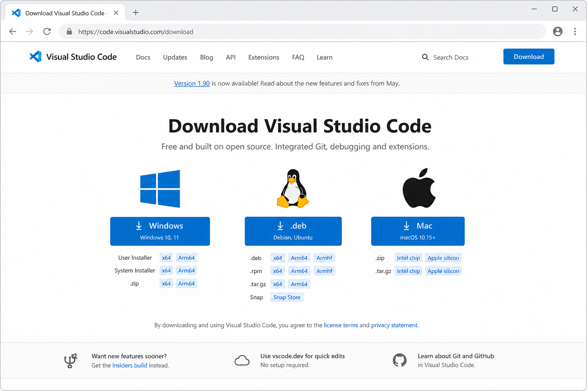
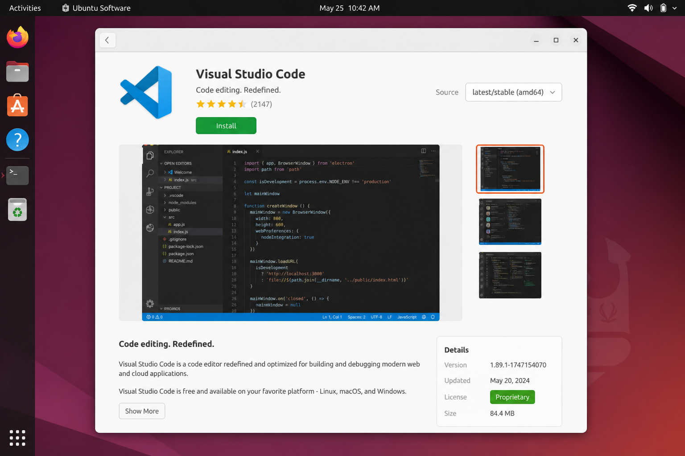
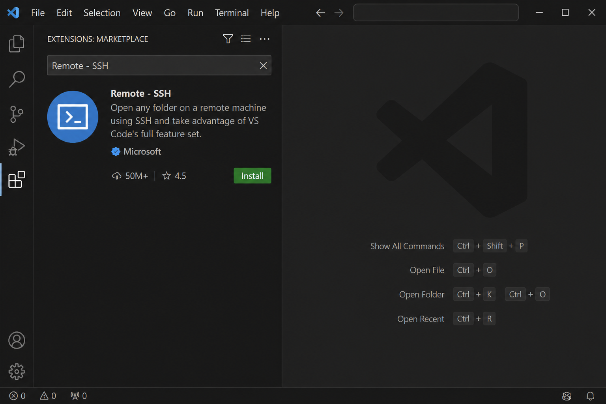
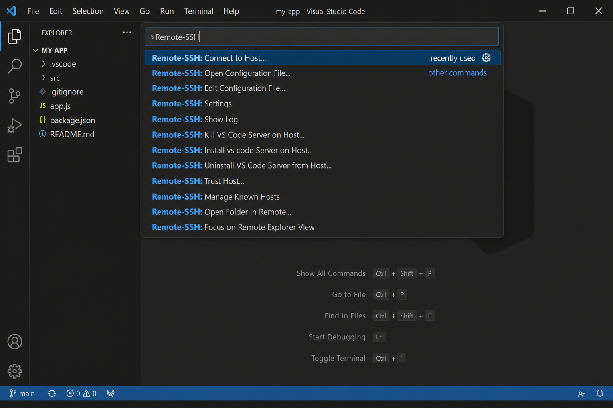
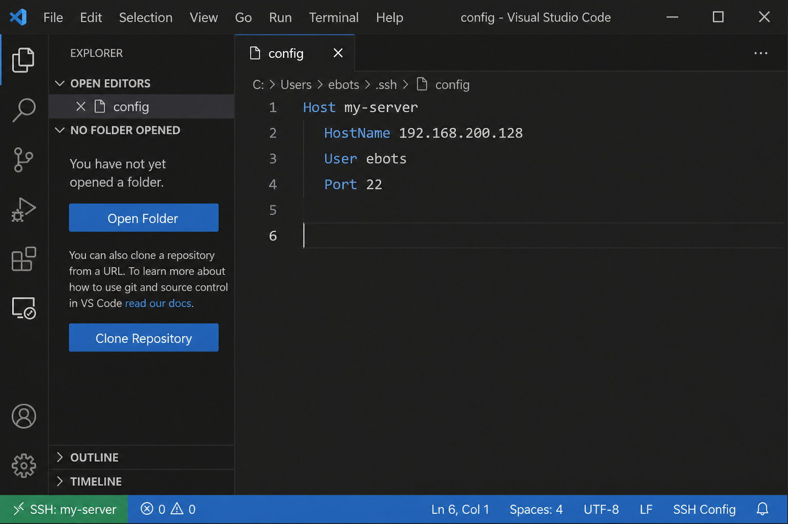
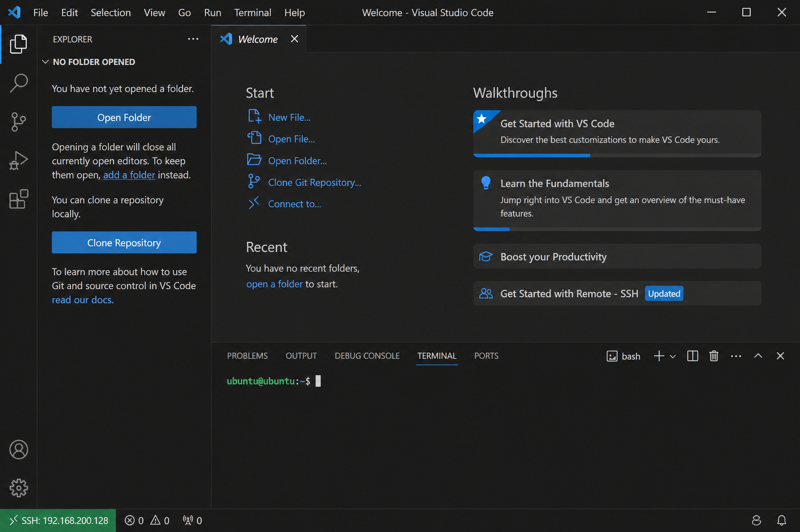

# VisualTrainFactory 使用手册（实习生版）

本文档面向实习生，按界面从左到右、从上到下说明：**怎么启动、整体流程是什么、每个 Tab / 每个控件做什么**。看完并按步骤操作后，应能独立完成一次「先标约 100 → 训练 → 推理辅助补标 → 微调」的闭环，而不是一次性把所有图标完再开训。

**第一次用、还不会连远程服务器？** 请先阅读 [第 0 章 零基础入门](#sec-0)（安装 VS Code + SSH），再读第 1 章。

## 目录

- [0. 零基础入门：安装 VS Code 并通过 SSH 连上服务器](#sec-0)
  - [0.1 这篇是给谁看的？需要先懂什么？](#sec-0-1)
  - [0.2 你需要提前准备的信息（找导师要）](#sec-0-2)
  - [0.3 第一步：安装 VS Code（代码编辑器）](#sec-0-3)
  - [0.4 第二步：安装 Remote - SSH 扩展](#sec-0-4)
  - [0.5 第三步：配置 SSH 连接信息](#sec-0-5)
  - [0.6 第四步：连上远程服务器](#sec-0-6)
  - [0.7 第五步：打开项目文件夹与日常操作](#sec-0-7)
  - [0.8 常见问题（连接阶段）](#sec-0-8)
- [1. 整体介绍](#sec-1)
  - [1.0 建议怎么使用本文档](#sec-1-0)
  - [1.1 软件是什么](#sec-1-1)
  - [1.2 如何启动](#sec-1-2)
    - [1.2.1 用 MobaXterm 远程显示界面（Windows）](#sec-1-2-1)
    - [1.2.2 用 VS Code Remote SSH 远程显示界面（Ubuntu）](#sec-1-2-2)
  - [1.3 推荐完整流程（按 Tab 顺序）](#sec-1-3)
  - [1.4 推荐工作方法：先标约 100 → 训练 → 迭代微调](#sec-1-4)
  - [1.5 工作目录约定](#sec-1-5)
  - [1.6 两种模型任务](#sec-1-6)
- [2. 公共区域（所有 Tab 共用）](#sec-2)
- [3. 各 Tab 说明](#sec-3)
  - [3.1 Tab「数据准备」](#sec-3-1)
  - [3.2 Tab「标注」](#sec-3-2)
  - [3.3 Tab「数据划分及预览」](#sec-3-3)
    - [3.3.1 子页「划分方式」](#sec-3-3-1)
    - [3.3.2 子页「标签处理」](#sec-3-3-2)
    - [3.3.3 子页「解释说明」](#sec-3-3-3)
  - [3.4 Tab「训练数据可视化」](#sec-3-4)
  - [3.5 Tab「训练」](#sec-3-5)
    - [3.5.1 子 Tab「YOLO」](#sec-3-5-1)
    - [3.5.2 子 Tab「HRNet」](#sec-3-5-2)
  - [3.6 Tab「推理与误差分析」](#sec-3-6)
- [4. 实习生自检清单（能否独立训练）](#sec-4)
- [5. 常见问题](#sec-5)
- [6. 和源码脚本的对应关系（可选阅读）](#sec-6)

---

## 0. 零基础入门：安装 VS Code 并通过 SSH 连上服务器 {#sec-0}

> **写在前面**：VisualTrainFactory 跑在**远程 Linux 服务器**上（因为需要 GPU）。你在自己电脑上看到的界面，是通过网络「远程显示」过来的。  
> 本章不讲训练本身，只教一件事：**怎么在自己电脑上装好 VS Code，并通过 SSH 连上服务器**。  
> 连上之后，再看 [第 1 章 整体介绍](#sec-1) 学习怎么启动和使用本软件。

---

### 0.1 这篇是给谁看的？需要先懂什么？ {#sec-0-1}

**适合**：第一次接触远程开发、从未用过 VS Code 或 SSH 的实习生。

**你不需要会编程**，只需要会：

- 在自己电脑上**下载、安装软件**
- **复制粘贴**文字（IP 地址、用户名、密码等）
- 用**鼠标点击**按钮和菜单

**两个词先搞懂**（不用背，用到时回来查即可）：

| 词 | 通俗解释 |
| --- | --- |
| **SSH** | 一种「安全远程登录」方式。就像用钥匙打开远程服务器的大门，进去之后可以在服务器上执行命令、跑程序。 |
| **VS Code** | 微软出的免费代码编辑器。装一个 **Remote - SSH** 扩展后，可以像操作本地文件夹一样，直接编辑远程服务器上的文件，并在远程终端里敲命令。 |

---

### 0.2 你需要提前准备的信息（找导师要） {#sec-0-2}

连服务器之前，请向导师或管理员确认下面 **4 项**（建议复制到记事本里，后面配置要用）：

| 序号 | 信息 | 示例 | 说明 |
| --- | --- | --- | --- |
| ① | **服务器 IP 或主机名** | `192.168.200.128` | 远程服务器的「门牌号」 |
| ② | **登录用户名** | `ebots` | 你在服务器上的账号 |
| ③ | **登录密码** 或 **私钥文件** | udcstb0327 | 远程的时候需要用 |
| ④ | **项目路径** | `/home/ebots/VisualTrainFactory` | 软件所在文件夹，连上后要打开它 |

> **提示**：密码不要发给无关人员；私钥文件（如 `id_rsa`）相当于钥匙，不要上传到网盘或聊天群。

---

### 0.3 第一步：安装 VS Code（代码编辑器） {#sec-0-3}

VS Code 官方下载页：<https://code.visualstudio.com/>

#### Windows 电脑

1. 打开上面的链接，页面会自动识别你的系统，点击蓝色按钮 **Download for Windows**。



2. 下载完成后，双击安装包（`.exe`），一路点 **下一步 / Next** 即可。
3. 建议勾选 **「添加到 PATH」** 和 **「创建桌面快捷方式」**（安装过程中如有选项）。
4. 安装完成后，桌面或开始菜单会出现 **Visual Studio Code** 图标，双击打开。

#### Ubuntu 电脑

**方式 A：用 `.deb` 包安装（推荐，和 Windows 一样简单）**

1. 打开 <https://code.visualstudio.com/>，点击 **Download for Linux**，选 **`.deb`**。
2. 下载完成后，双击 `.deb` 文件，在软件中心里点 **安装**。



**方式 B：用命令行安装**

在终端里执行（需联网）：

```bash
sudo snap install code --classic
```

#### 验证是否安装成功

打开 VS Code 后，应看到欢迎页或空白编辑区，左侧有一竖排图标（资源管理器、搜索、扩展等）。  
若能看到这些，说明安装成功，进入下一步。

---

### 0.4 第二步：安装 Remote - SSH 扩展 {#sec-0-4}

扩展 = VS Code 的「插件」，装好后才能远程连 Linux 服务器。

1. 打开 VS Code。
2. 点击左侧边栏的 **扩展** 图标（四个小方块，或按快捷键 `Ctrl+Shift+X`）。
3. 在顶部搜索框输入：**Remote - SSH**。
4. 找到 **Microsoft** 发布的那一项（全名一般是 **Remote - SSH**，图标带 `><` 符号），点击 **Install（安装）**。
5. 装好后按钮会变成 **已安装** 或出现齿轮图标。



> 可选：同系列还可安装 **Remote - SSH: Editing Configuration Files**，方便图形化编辑 SSH 配置；不装也能用，本章用手写配置文件即可。

---

### 0.5 第三步：配置 SSH 连接信息 {#sec-0-5}

把「服务器门牌号 + 你的用户名」告诉 VS Code，以后一点就能连。

#### 3.1 打开 SSH 配置文件

1. 按 `F1` 或 `Ctrl+Shift+P`，弹出顶部输入框（**命令面板**）。
2. 输入 **`Remote-SSH: Open SSH Configuration File...`**（中文界面可能是「远程-SSH: 打开 SSH 配置文件…」）。
3. 列表里选 **`/home/你的用户名/.ssh/config`**（Windows 一般是 `C:\Users\你的用户名\.ssh\config`）。  
   - 若提示文件不存在，选 **Create** 创建即可。



#### 3.2 写入连接信息

在打开的文件末尾追加（**把示例改成导师给你的真实信息**）：

```text
Host visual-train-server
    HostName 192.168.200.128
    User ebots
    Port 22
```

| 字段 | 填什么 |
| --- | --- |
| `Host` | 自己起的别名，以后在 VS Code 里显示这个名字，随便起好记的即可 |
| `HostName` | 服务器 IP 或主机名 |
| `User` | 登录用户名 |
| `Port` | 一般是 `22`；若管理员说改过端口，按实际填写 |



4. 按 `Ctrl+S` **保存**文件。

#### 3.3 若使用密钥登录（导师给了 `.pem` 或 `id_rsa` 文件）

在同样一段配置里多加一行（路径改成你的密钥实际位置）：

```text
Host visual-train-server
    HostName 192.168.200.128
    User ebots
    Port 22
    IdentityFile C:\Users\你的用户名\.ssh\id_rsa
```

Linux 上密钥权限过宽会导致拒绝连接，需执行一次：

```bash
chmod 600 ~/.ssh/id_rsa
```

---

### 0.6 第四步：连上远程服务器 {#sec-0-6}

1. 点击 VS Code **左下角绿色区域**（可能显示 `><` 或「打开远程窗口」）。
2. 选 **Connect to Host…（连接到主机…）**。
3. 在列表里点你刚配置的 **`visual-train-server`**（或你起的 `Host` 名）。
4. 选系统类型 **Linux**（首次连接会问）。
5. 若提示输入密码，输入导师给的密码（输入时屏幕**不会显示星号**，属正常，输完按回车）。
6. 等待右下角进度条走完；左下角变成 **`SSH: visual-train-server`** 或 **`SSH: 192.168.200.128`** 即表示成功。



**第一次连接可能较慢**（要在服务器上下载 VS Code Server），请耐心等待，不要重复点连接。

#### 连上后建议做的两件事

1. **新开终端**：菜单 **终端 → 新建终端**（或 `` Ctrl+` ``），此时终端里运行的命令都在**远程服务器**上执行，不是本机。
2. **测一下是否在远程**：在终端输入：

```bash
hostname
pwd
```

应看到服务器主机名和远程路径，而不是你笔记本的名字。

---

### 0.7 第五步：打开项目文件夹与日常操作 {#sec-0-7}

#### 打开 VisualTrainFactory 项目

1. 菜单 **文件 → 打开文件夹…**（File → Open Folder…）。
2. 输入或浏览到导师给的路径，例如：`/home/ebots/VisualTrainFactory`。
3. 若提示「是否信任此文件夹」，选 **是 / Trust**。
4. 左侧资源管理器会出现项目文件树，说明已在远程项目中工作。

#### 启动本软件（连上且配置好显示后）

在 VS Code **远程终端**里执行：

```bash
cd /home/ebots/VisualTrainFactory   # 路径按实际修改
conda activate openmmlab
python VisualTrainFactory.py
```

若窗口能弹出，说明远程连接和图形显示都已打通，可继续阅读 [1.2 如何启动](#sec-1-2) 及后续章节。

> **Ubuntu 用户若界面弹不出来**：SSH 已通，但还需配置 **X11 图形转发**，请直接看 [1.2.2 用 VS Code Remote SSH 远程显示界面（Ubuntu）](#sec-1-2-2)。  
> **Windows 用户**：图形界面更推荐 [1.2.1 MobaXterm](#sec-1-2-1)；VS Code 主要用于编辑远程文件和在终端里跑命令。

#### 以后每天怎么用（最简流程）

```text
打开 VS Code → 左下角 Connect to Host → 选 visual-train-server → 打开项目文件夹 → 终端里 conda activate → python VisualTrainFactory.py
```

#### 常用快捷键（记住两三个就够）

| 操作 | Windows / Linux |
| --- | --- |
| 打开命令面板 | `Ctrl+Shift+P` |
| 打开/关闭终端 | `` Ctrl+` `` |
| 保存文件 | `Ctrl+S` |
| 断开远程 | 左下角绿色 `SSH:…` → **Close Remote Connection** |

---

### 0.8 常见问题（连接阶段） {#sec-0-8}

| 现象 | 可能原因 | 处理办法 |
| --- | --- | --- |
| 列表里看不到我的 Host | 配置文件没保存或路径选错 | 重新 `Open SSH Configuration File`，确认 `Host` 段已写入并 `Ctrl+S` |
| `Connection timed out` | IP 错、没连公司网/VPN、防火墙拦截 | 核对 IP；连上内网或 VPN 后再试；联系管理员 |
| `Permission denied (publickey)` | 密钥不对或未配置 | 检查 `IdentityFile` 路径；或改用密码登录 |
| 密码输对仍进不去 | 用户名错、账号未开通 | 找导师核对用户名和权限 |
| 左下角一直卡在「Setting up SSH Host」 | 网络慢或服务器首次装 VS Code Server | 多等几分钟；仍失败可试 **Remote-SSH: Kill VS Code Server on Host** 后重连 |
| 终端里命令报 `command not found: conda` | conda 未初始化 | 问导师要环境加载方式，或执行 `source ~/miniconda3/etc/profile.d/conda.sh` 后再 `conda activate openmmlab` |
| 能连上但 `python VisualTrainFactory.py` 没窗口 | 未配置 X11 图形转发 | Ubuntu 见 [1.2.2](#sec-1-2-2)；Windows 见 [1.2.1 MobaXterm](#sec-1-2-1) |

---

## 1. 整体介绍

### 1.0 建议怎么使用本文档

如果你是第一次接触本平台，**不要一上来就对着界面乱点**。建议按下面顺序来：

0. **若从未用过 VS Code 或 SSH 连远程服务器**  
   请先完整做完 [第 0 章 零基础入门](#sec-0)（安装 VS Code、装 Remote - SSH 扩展、连上服务器），再往下看。
1. **先通读本文档**
  - 至少完整看完本章（整体介绍）和 [第 2 章 公共区域](#sec-2)，对全流程和界面布局有整体印象。
  - [第 3 章 各 Tab 说明](#sec-3) 可以先浏览一遍，知道后面会用到哪些页面和控件；细节操作时再回来查。
2. **准备一批数据**
  - 向导师或项目同事要一小批真实图片，或从已有采集目录里挑一个文件夹。
  - 数量不必多，够跑通一次闭环即可（参见 [1.4](#sec-1-4)「先标约 100」的建议）。
3. **从 [3.1 Tab「数据准备」](#sec-3-1) 开始，按 Tab 顺序实操一遍**
  ```text
   3.1 数据准备 → 3.2 标注 → 3.3 划分 → 3.4 可视化 → 3.5 训练 → 3.6 推理
  ```
   对照文档里的步骤和控件说明，一步一步做；卡在某一步时，再回看对应小节。
4. **跑通后再对照 [第 4 章 自检清单](#sec-4)**，确认自己已经能独立走完流程；常见问题见 [第 5 章](#sec-5)。

**一句话**：第 1 章讲「为什么、整体怎么走」；第 3 章讲「具体点哪里」。**先理解，再动手；动手时从 3.1 顺着做下去。**

### 1.1 软件是什么

**VisualTrainFactory**（窗口标题：`YOLO + HRNet 全流程训练平台`）是一个桌面 GUI 工具，把视觉模型训练相关步骤串在一起：


| 阶段      | 做什么                                                                                          |
| ------- | -------------------------------------------------------------------------------------------- |
| 数据准备    | 把原始图片按规则收集、打乱、分组，写入工作目录下的 `group_data`                                                       |
| 标注      | 本软件暂时**不内置标注**；用 [Labelme](https://github.com/wkentaro/labelme) 在 `group_data` 里标点/框，生成 JSON |
| 数据划分及预览 | 扫描标注、配置标签 ID / 用途，划分 train/val/test，并写出 YOLO（及关键点任务下的 HRNet）训练数据                             |
| 训练数据可视化 | 检查划分后的图片 + 标签是否正确                                                                            |
| 训练      | 训练 YOLO（关键点 / OBB）或 HRNet                                                                    |
| 推理与误差分析 | 用训练好的模型做批量推理、导出 ONNX、统计误差                                                                    |


启动后的主界面大致如下（红框编号对应第 2 节公共区域）：

主界面总览（带标注）


| 编号  | 区域                |
| --- | ----------------- |
| ①   | 模型任务（关键点识别 / obb） |
| ②   | 打开工作目录            |
| ③   | 左侧文件夹树            |
| ④   | 主 Tab 栏（流程顺序）     |
| ⑤   | 底部日志区             |


### 1.2 如何启动

本软件依赖 GPU，通常部署在**远程 Linux 服务器**上。GUI 需通过 X11 转发到本机显示，按本机系统选择配置方式：

- **Windows 本机**：见 [1.2.1](#sec-1-2-1)，用 **MobaXterm**（Windows 专用）连远程并转发界面。
- **Ubuntu 本机**：见 [1.2.2](#sec-1-2-2)，用 **VS Code Remote SSH** 连远程；需额外修正 `DISPLAY` 变量。

#### 在服务器上启动（已连上且 X11 可用时）

进入项目目录，激活 conda 环境 `openmmlab`，然后：

```bash
python VisualTrainFactory.py
```

若窗口能正常弹出，说明远程显示已打通。

若提示 `DISPLAY` 相关错误或界面不出现，请按本机系统完成 [1.2.1](#sec-1-2-1) 或 [1.2.2](#sec-1-2-2) 的配置。

#### 1.2.1 用 MobaXterm 远程显示界面（Windows）

> **MobaXterm 仅适用于 Windows。** Ubuntu 用户请直接看 [1.2.2](#sec-1-2-2)。

##### ① 下载与安装

1. 打开官网下载页：[MobaXterm Home Edition](https://mobaxterm.mobatek.net/download-home-edition.html)（免费版即可）。
2. 任选一种：
  - **Installer edition**：安装到本机，有开始菜单快捷方式。
  - **Portable edition**：解压即可用，适合没有管理员权限的电脑。
3. 安装或解压完成后，打开 **MobaXterm**。

##### ② 新建 SSH 会话并开启 X11 转发

1. 点击左上角 **Session**。
2. 选择 **SSH**。
3. 填写：
  - **Remote host**：服务器 IP 或主机名
  - **Specify username**：勾选并填入你的 Linux 用户名
  - **Port**：一般是 `22`（若服务器改过端口则按实际填写）
4. 切到 **Advanced SSH settings**，确认勾选 **X11-Forwarding**（多数版本默认已勾选，务必检查一次）。
5. 若用密钥登录：在同一页指定 **Use private key**，选中你的私钥文件。
6. 点 **OK** 保存并连接；首次连接按提示确认主机指纹，再输入密码（或由密钥自动登录）。

连接成功后，终端里可检查显示变量（一般由 MobaXterm 自动设置）：

```bash
echo $DISPLAY
```

若有类似 `localhost:10.0` 的输出，说明 X11 转发正常。

##### ③ 在远程终端里启动本软件

```bash
# 按你们环境实际路径进入项目
cd /path/to/VisualTrainFactory

conda activate openmmlab
python VisualTrainFactory.py
```

稍等片刻，本机应弹出 **「YOLO + HRNet 全流程训练平台」** 窗口。之后按本文后续章节操作即可。

##### ④ 常见问题（远程显示）


| 现象                                      | 处理建议                                              |
| --------------------------------------- | ------------------------------------------------- |
| 启动后无界面 / 报 `cannot connect to X server` | 确认会话里已勾选 **X11-Forwarding**；重新开一个新 Session 再试     |
| `echo $DISPLAY` 为空                      | 当前终端不是带 X11 的 SSH 会话；请用 MobaXterm 新建并勾选 X11 的会话登录 |
| 界面很卡、拖动迟钝                               | X11 经网络转发本身偏慢，属正常；尽量在内网连接，或减少频繁刷新大图的操作            |
| 只有黑窗 / 字体乱码                             | 服务器需有基本的 Qt / X11 字体与依赖；向管理员确认 `openmmlab` 环境是否完整 |


#### 1.2.2 用 VS Code Remote SSH 远程显示界面（Ubuntu）

Ubuntu 本机自带 X Server，图形程序可以显示在本机屏幕上。建议**先在本机 Terminal 自检 X11 转发是否正常**，再排查 VS Code。

**步骤 1：本机 Terminal 连远程（先确认基线）**

在 Ubuntu **本机**打开 Terminal（不要开 VS Code），执行：

```bash
ssh -Y ebots@192.168.200.128
```

连上远程后执行：

```bash
echo $DISPLAY
xeyes
```

按 `echo $DISPLAY` 的结果分三种情况处理：

**情况 A：`echo $DISPLAY` 为空**

说明当前 SSH 会话**没有开启 X11 转发**，先不要进 VS Code，在本机 Terminal 里排查：

1. 确认用的是 `ssh -Y`（或 `ssh -X`），不是普通 `ssh`。
2. 本机 `~/.ssh/config` 里对该主机可加（将 `远程主机` 换成实际 IP 或主机名）：
  ```text
  Host my-remote
      HostName 192.168.200.128
      User yourname
      ForwardX11 yes
      ForwardX11Trusted yes
  ```
3. **断开重连**后再执行 `echo $DISPLAY`，应有类似 `localhost:10.0` 的输出。

仍为空则 X11 基线未打通，需先解决此项，再往下看 VS Code。

**情况 B：有 `DISPLAY` 值，且 `xeyes` 能弹出**

说明本机 X Server、SSH X11 转发、远程环境**都正常**。本机 Terminal 里常见为 `localhost:10.0`（display 编号也可能是 `:11.0` 等，属正常）。可进入步骤 2 对比 VS Code。

**情况 C：有 `DISPLAY` 值，但 `xeyes` 报错**

X11 转发已部分生效，但认证或地址可能有问题。可先试：

```bash
export DISPLAY=localhost:10.0   # 编号以 echo $DISPLAY 为准，可能是 :11.0
xeyes
```

仍失败见下文「若改成 `localhost:…` 仍报错」（xauth 相关）。

**步骤 2：VS Code Remote SSH 连同一台远程（对比 VS Code 差异）**

在步骤 1 **情况 B 已通过**的前提下，再用 **VS Code Remote SSH** 连**同一台**远程，在 VS Code 远程终端重复：

```bash
echo $DISPLAY
xeyes
```

常见现象：步骤 1 里 Terminal 正常，而 VS Code 里出现以下之一：


| VS Code 里 `echo $DISPLAY`             | `xeyes` 结果                          | 含义                                        |
| ------------------------------------- | ----------------------------------- | ----------------------------------------- |
| **为空**                                | 报错                                  | VS Code 这条 SSH 连接未带上 X11 转发；见下文「原因与修复」（1） |
| **有值，但是 `ebots-prod-1:10.0` 这类远程主机名** | 报错 `can't open display: …`或者什么都不显示 | X11 转发已开，但 `DISPLAY` 主机名写错，程序连错了地址        |
| `**localhost:10.0`（或 `:11.0` 等）**     | 能弹出                                 | VS Code 已正常，可直接启动本软件                      |


最后一行（主机名为 `localhost` 且 `xeyes` 正常）即无需再改 `DISPLAY`。若属于「为空」或「主机名是远程主机名」，见下文原因与修复。

##### 原因与修复

**（1）`DISPLAY` 为空**

表示当前终端所在的 SSH 连接**没有建立 X11 转发**。

- **步骤 1（本机 Terminal）**：见上文情况 A（`ssh -Y`、`ForwardX11`、远程 `sshd_config`）。
- **步骤 2（VS Code）**：在本机 VS Code `settings.json` 确认 Remote SSH 已开 X11 转发，例如：
  ```json
  {
    "remote.SSH.enableX11Forwarding": true
  }
  ```
  保存后断开 Remote SSH **重连**，新开远程终端再 `echo $DISPLAY`。
- 步骤3 （VS code）：如果始终没有值，那么做如下尝试：  
    ```json
  export DISPLAY=ebots-prod-1:11.0 (具体的值，是本机 Terminal 中 echo $DISPLAY 的值)
  xeyes
  ```
  如果正常弹窗，那么进入下一节。

**（2）**`DISPLAY` **有值，但是运行** `xeyes` 不弹窗显示

  一般情况下，是 `DISPLAY` 的值不对了。也就是主机的 `terminal` 中的 `DISPLAY` 和 `vscode ssh remote terminal` 中的 `DISPLAY` 不一样。这里的不一样，又包含两种情况，一： `vscode ssh remote terminal` 中， `DISPLAY` 是空值，二：有值，但是值不一样，仅有微小的差异，要仔细观察。

- 先在主机 `terminal` 下（不是 `vscode` ），运行 `echo $DISPLAY` ，记录结果，如 `ebots-prod-1:10.0`
- 连上 Remote SSH 后：`Ctrl+Shift+P` → **Preferences: Open Remote Settings (JSON)**，加入：

```json
{
  "terminal.integrated.env.linux": {
    "DISPLAY": "ebots-prod-1:10.0"
  }
}
```

关掉远程终端，新开一个，确认：

```bash
echo $DISPLAY    # 应是 localhost:10.0
xeyes
```


VS Code 断开重连再试。


| 操作                                               | 结果                       |
| ------------------------------------------------ | ------------------------ |
| 断开 VS Code Remote SSH 再连                         | 新连接 → 新编号（10 → 11 → 12…） |
| Kill VS Code Server on Host 后重连                  | 同上                       |
| 本机 Terminal 里 `ssh -Y 用户名@远程主机` 仍连着，同时又开 VS Code | 两个连接各占一个号（`:10` 和 `:11`） |


因此不要写死 `DISPLAY=localhost:10.0` 后长期不管；重连后先用 `echo $DISPLAY` 看当前编号。


##### 常见问题（VS Code + Ubuntu）


| 现象                             | 处理建议                                                                          |
| ------------------------------ | ----------------------------------------------------------------------------- |
| `can't open display: 主机名:10.0` | 把 `DISPLAY` 改为 `localhost:10.0`（或 `.bashrc` 自动改 host）；见上文                     |
| 重连后 `localhost:10.0` 又不行       | 编号可能已是 `:11.0`；`echo $DISPLAY` 后改用 `localhost:11.0`，或用法 2 的 `.bashrc`         |
| `echo $DISPLAY` 为空             | 确认 VS Code 远程 settings 或本机 SSH 已开 X11 转发；本机 Terminal 用 `ssh -Y 用户名@远程主机` 对比测试 |
| 界面很卡                           | X11 经网络转发偏慢，属正常；尽量内网连接                                                        |


### 1.3 推荐完整流程（按 Tab 顺序）

主流程就在中间这一排 Tab 上，从左到右做即可：

主 Tab 栏

```
打开工作目录
    → 【数据准备】处理原始图 → 得到 group_data/
    → 【标注】用 Labelme 标注 group_data（本 Tab 只是说明）
    → 【数据划分及预览】扫描标签 → 配映射 → 开始划分 → 得到 datasets/
    → 【训练数据可视化】抽查标注是否画对
    → 【训练】YOLO / HRNet
    → 【推理与误差分析】批量推理 / 导出 ONNX / 看误差
```

顶部 **模型任务** 会贯穿多个 Tab，请先选对再划分和训练。

上面是「软件里点哪里」的顺序；真正干活时**不要一次把几千张图全标完再训练**，请按下一节的迭代方法。

### 1.4 推荐工作方法：先标约 100 → 训练 → 迭代微调

新人最容易犯的错是：觉得数据越多越好，于是一口气标几百、上千张，再第一次开训——既慢，又难以及早发现标注规范问题。正确做法是**小步快跑**：

```text
数据准备（得到 group_data）
    → ① 先认真标注约 100 张（覆盖常见场景）
    → ② 划分 → 可视化抽查 → 训练出第一个可用模型
    → ③ 用模型推理未标注 / 新数据，人工改错补标（放大数据集）
    → ④ 重新划分 → 用上一轮权重继续训 / 微调
    → ⑤ 看误差，不够好就回到 ③，循环直到达标
```

#### ① 第一轮：只标约 100 张

- 在 Labelme 里先标 **大约 100 张**（不必死抠数字，一个完整 `group_XXX` 或挑若干组即可）。
- 这 100 张要尽量覆盖真实场景：不同姿态、光照、遮挡、典型缺陷等，而不是连续几乎一模一样的帧。
- 标注规范要定死（点的顺序、框怎么贴边、标签命名），后面所有轮次都沿用同一套，否则模型会学乱。
- 标完 →「数据划分及预览」→「训练数据可视化」翻几张确认没画错 → 再进「训练」。

#### ② 第一轮训练：尽快拿到「能用的模型」

- 用这批小数据训出第一版 YOLO（关键点任务可再视情况训 HRNet）。
- 目的不是一次训到完美，而是**尽快得到能辅助标注 / 能看出问题的模型**。
- 结果一般在 `runs/pose/<时间戳>/weights/best.pt`（或 `runs/obb/...`）。

#### ③ 迭代：推理辅助 → 人工修正 → 数据变多

- 打开「推理与误差分析」，选中刚训好的模型，对**尚未标注**或**新采集**的图片做批量推理。
- 对照可视化结果（`vis/`）或导出的 JSON，用 Labelme **改错、补漏、删误检**，把正确标注写回 `group_data`。
- 这一步相当于「模型帮你打草稿，人来把关」——比纯手标快很多，也比直接相信模型安全。

#### ④ 微调 / 再训练

- 把新旧标注合在一起，再跑一次「扫描标签 → 划分」。
- 再进「训练」时，**预训练权重**可填上一轮的 `best.pt` 路径（或文件名，按你们环境约定），在更大、更干净的数据上继续训，这就是常说的**微调**。
- 也可先用官方预训练（如 `yolo26n-pose.pt`）开新训；数据量明显变大、分布有变化时，两种都能试，以验证集误差为准。

#### ⑤ 何时可以停

- 在「推理与误差分析」里对验证/测试图看误差直方图与可视化；抽查失败案例，判断是标注问题还是模型能力问题。
- 误差达标、线上场景抽测可接受 → 导出 ONNX 交付。
- 仍有系统性错误（某类点总偏、某类框总漏）→ 针对性地再标一批难例，回到 ③④，而不是盲目加 Epoch。

**一句话**：先用约 100 张打通全流程并定规范 → 用模型加速后续标注 → 数据变好后再微调；界面上的 Tab 顺序（1.3）在每一轮迭代里都会再走一遍「划分 → 训练 → 推理」。

### 1.5 工作目录约定

先点 **「打开工作目录」**，选一个空文件夹或已有项目文件夹。后续输出都会落在这个目录下：

打开工作目录

```text
工作目录/
├── group_data/              # 分组后的待标注 / 已标注数据
│   ├── group_000/
│   ├── group_001/
│   └── ...
├── datasets/                # 划分后的训练数据
│   ├── images/{train,val,test}/
│   ├── labels/{train,val,test}/
│   ├── train_keypoints.json # HRNet 用（关键点任务）
│   └── val_keypoints.json
├── Pose.yaml / Obb.yaml     # YOLO 数据配置（训练时自动维护）
├── runs/
│   ├── pose/                # 关键点 YOLO 训练结果
│   ├── obb/                 # OBB YOLO 训练结果
│   └── HRNet/               # HRNet 训练结果
├── batch_infer_result/      # 默认批量推理输出（可改名）
└── VisualFactoryConfig.json # 该工作目录下控件状态自动保存
```

关闭窗口时，当前工作目录会记住；界面上的多数输入框、勾选框也会写回该配置，下次打开可恢复。

### 1.6 两种模型任务

就在窗口**最上方标题栏右侧**，标签文字是「模型任务」，两个单选项：

模型任务位置


| 选项        | 含义                      | 后续影响                                               |
| --------- | ----------------------- | -------------------------------------------------- |
| **关键点识别** | YOLO Pose +（可选）HRNet    | 划分时写关键点格式；可训练 HRNet；推理可叠 HRNet                     |
| **obb**   | YOLO 旋转框（Oriented BBox） | 划分走 OBB；**不能**训练 / 导出 HRNet；按钮文案变为「开始 YOLO OBB 训练」 |


选错任务会导致划分格式或训练脚本不匹配，**划分前务必确认**。

---

## 2. 公共区域（所有 Tab 共用）

这些控件不在某个 Tab 里，但几乎每一步都要用。对照总览图中的 ①～⑤：


| 控件                    | 含义与用法                                                                                |
| --------------------- | ------------------------------------------------------------------------------------ |
| **模型任务**（关键点识别 / obb） | 见上一节。切换后训练页、推理页可用功能会跟着变。                                                             |
| **打开工作目录**            | 弹出文件夹选择框，设为当前项目根目录。                                                                  |
| **工作目录下拉框**           | 可选手动输入路径，或从最近使用过的目录里选。必须是有效目录。                                                       |
| **左侧文件夹树**            | 显示当前工作目录下的文件结构。在「数据准备」里：点选**源图片所在文件夹**再点「处理数据」。在「训练数据可视化 / 推理」里：点选某个子文件夹，作为浏览或批处理范围。 |
| **底部日志区**             | 所有操作进度、报错、完成信息都会打在这里。训练/推理时请盯着看。                                                     |


左侧树与日志示意：


| 左侧文件夹树 | 底部日志区 |
| ------ | ----- |
| 左侧文件夹树 | 底部日志区 |


---

## 3. 各 Tab 说明

### 3.1 Tab「数据准备」

**目的**：从原始采集目录收集图片，打乱后按「每组 N 张」拷贝到 `工作目录/group_data/group_XXX/`，方便后续用 Labelme 分组标注。

数据准备页

**操作步骤**：

1. 确认已打开工作目录。
2. 在左侧树中选中**原始图片所在文件夹**（不是工作目录本身，而是数据源）。
3. 选数据来源、相机、Group Size、是否 TIFF 转 PNG。
4. 点 **「处理数据」**。
5. 日志里看到「数据处理完成」即成功；默认可**追加**到已有 `group_data`（不会从 0 覆盖清空已有 group）。

本页控件区域特写：

数据准备控件

#### 本页控件


| 控件                                                            | 含义                                                                                                              |
| ------------------------------------------------------------- | --------------------------------------------------------------------------------------------------------------- |
| **Group Size**                                                | 每个 `group_XXX` 文件夹里放多少张图。例如 `100` 表示约每 100 张一组。                                                                 |
| **checkBoxTiff2Png**                                          | 勾选后，读写图像时把非 uint8（常见 TIFF）归一化成 uint8 再存成 PNG。右侧提示公式：`uint8(255*(img-min)/(max-min))`。普通 JPG/PNG 一般可不勾。          |
| **数据来源 · system**                                             | 按现有系统目录结构采集。约定：源目录下存在名为 `denali` 的文件夹；其下按时间戳子目录排序，第 0 个当作 denali0，第 1 个当作 denali1；再进 `Cam0` / `Cam1`。需至少勾选一个相机。 |
| **数据来源 · ui**                                                 | UI 采集数据源（当前代码为占位，**尚未实现**，不要选这个做正式任务）。                                                                          |
| **数据来源 · unknow**                                             | 不知道来源时用：递归收集该文件夹下**所有**图片，混在一起再分组。                                                                              |
| **denali0_cam0 / denali0_cam1 / denali1_cam0 / denali1_cam1** | 仅在 **system** 模式下生效：勾选要纳入训练的相机通道。system 模式下至少勾一个。                                                               |
| **处理数据**                                                      | 开始执行分组拷贝。输出到 `工作目录/group_data`。                                                                                 |
| **说明文字**                                                      | 页面内帮助：选中左侧文件夹 → 处理数据 → 写入 GroupData；默认追加写入。                                                                     |


---

### 3.2 Tab「标注」

**目的**：提醒你去外部工具标注，**本软件不提供标注界面**。

标注页

#### 本页说明

用 **Labelme** 打开 `group_data` 下各个 `group_XXX`，对图片画点 / 多边形 / 矩形等，保存同名 `.json`。

**第一轮建议只标约 100 张**，跑通训练后再用模型辅助扩标；完整策略见 [1.4](#sec-1-4)。

标注完成后回到软件，进入下一个 Tab。

---

### 3.3 Tab「数据划分及预览」

**目的**：读 `group_data` 里的 Labelme JSON，配置「哪个标签参与训练、训练时 ID 是多少」，再按比例划分 train / val / test，写出 YOLO 数据集；关键点任务下还会额外生成 HRNet 用的 JSON。

进入本页时，日志会提示可以点「扫描所有文件」。

页面内还有三个子页：**划分方式**、**标签处理**、**解释说明**。

#### 3.3.1 子页「划分方式」

划分方式


| 控件          | 含义                                                   |
| ----------- | ---------------------------------------------------- |
| **写入策略**    | 下拉两项，见下表。                                            |
| **覆盖旧划分**   | 先删掉已有 `datasets` 划分结果，再对当前 `group_data` 重新划分。适合推倒重来。 |
| **追加到现有划分** | 只对「现有划分里还没有」的数据做划分并追加。适合陆续补充新 group。                 |
| **训练集比例**   | 默认 `0.8`。与验证、测试比例之和建议为 `1.0`。                        |
| **验证集比例**   | 默认 `0.1`。                                            |
| **测试集比例**   | 默认 `0.1`。                                            |
| **随机种子**    | 默认 `42`。相同种子可复现同一次随机划分结果。                            |


#### 3.3.2 子页「标签处理」

标签处理


| 控件             | 含义                                                                           |
| -------------- | ---------------------------------------------------------------------------- |
| **扫描所有文件**     | 递归扫描 `group_data` 下所有 JSON，汇总出现过的标签名、类型（点/多边形等）、多边形点数分布；异常点数会打日志。扫描后下方表格会刷新。 |
| **特征点个数（NFP）** | 关键点任务里每个实例期望的关键点数量。扫描后常会自动填成「最常见的多边形点数」；也可手动改。必须是正整数。                        |
| **标签映射表**      | 四列，见下。                                                                       |


**标签映射表各列：**


| 列名        | 含义                                                                                   |
| --------- | ------------------------------------------------------------------------------------ |
| **Label** | JSON 里的标签名（只读）。                                                                      |
| **类型**    | 该标签在数据里主要是什么形状；若是 polygon 会显示点数。                                                     |
| **训练时ID** | 写入 YOLO 类别 ID。要求：**从 0 开始连续**（0,1,2,…），不能跳号。若标签名本身是数字，会默认填进该数字，仍请核对。                 |
| **请选择用途** | `用于训练`：参与 YOLO/HRNet 训练数据；`用于遮挡点`：当作遮挡矩形，被盖住的点 `visible=0`；`请选择用途` 为占位，实际会默认成「用于训练」。 |


只有用途为 **「用于训练」** 且填了有效 ID 的标签才会进入训练映射；遮挡类标签走遮挡逻辑，不进类别表。

#### 3.3.3 子页「解释说明」

内置简短帮助，与上文写入策略、标签用途一致，可随时查看。

#### 本页底部按钮


| 控件       | 含义                                                                                             |
| -------- | ---------------------------------------------------------------------------------------------- |
| **开始划分** | 校验标签 ID → 按顶部「模型任务」调用关键点或 OBB 转换；关键点时还会生成 HRNet JSON。结果写入 `datasets/`，日志会打印 train/val/test 数量。 |


**常见失败原因**：未选工作目录、没有 `group_data`、未扫描/未填训练时 ID、标签 ID 不连续、比例或 NFP 非法。

---

### 3.4 Tab「训练数据可视化」

**目的**：在划分完成后，抽查 `datasets` 里图片与标签是否对齐（框、关键点是否画对）。

训练数据可视化

**操作要点**：

1. 在左侧树中选中 `group_data` 下某个文件夹（或含图片的子目录）。
2. 软件会按图片文件名，到 `datasets/images/{train,val,test}` 里找对应图，并加载同名 label。
3. 用按钮或快捷键翻页查看。

#### 本页控件


| 控件        | 含义                  |
| --------- | ------------------- |
| **上一张 A** | 显示上一张；也可按键盘 **A**。  |
| **下一张 D** | 显示下一张；也可按键盘 **D**。  |
| **进度文字**  | 形如 `当前序号 / 总数 文件名`。 |
| **画布**    | 叠加绘制标签后的预览图。        |


若显示 `0 / 0`：多半是左侧没选对含图文件夹，或还没完成划分、文件名对不上。

---

### 3.5 Tab「训练」

**目的**：在已有 `datasets` 和标签映射的前提下启动训练。内含两个子 Tab：**YOLO**、**HRNet**。

进入本页会按「模型任务」同步 UI：选 **obb** 时 HRNet 子页与按钮会禁用，YOLO 按钮变为「开始 YOLO OBB 训练」，预训练权重后缀会在 `-pose.pt` / `-obb.pt` 间切换。

训练前请确认：

- 工作目录正确；
- 「数据划分及预览」里已扫过并填好训练时 ID（YOLO 训练会读这份映射）；
- GPU 编号与本机一致。

#### 3.5.1 子 Tab「YOLO」

YOLO 训练页


| 控件             | 含义                                                                                  |
| -------------- | ----------------------------------------------------------------------------------- |
| **Epochs**     | 训练轮数。默认 `300`。                                                                      |
| **Img Size**   | 输入边长（像素）。默认 `1280`。越大越吃显存。                                                          |
| **Batch**      | 批大小。默认 `16`。显存不够就调小。                                                                |
| **Workers**    | DataLoader 工作进程数。默认 `8`。                                                            |
| **GPU**        | 设备号，多个用逗号，如 `0` 或 `0,1`。                                                            |
| **预训练权重**      | 初始权重文件名，如 `yolo26n-pose.pt`（关键点）或对应 `-obb.pt`。空则按训练脚本默认处理。                          |
| **水平翻转概率**     | 数据增强：水平翻转概率，默认 `0.5`。                                                               |
| **上下翻转概率**     | 数据增强：垂直翻转概率，默认 `0`。关键点若上下翻转会破坏语义时请保持 0。                                             |
| **开始 YOLO 训练** | 启动 Pose 或 OBB 训练。结果一般在 `runs/pose/<时间戳>/` 或 `runs/obb/<时间戳>/`，常用 `weights/best.pt`。 |


#### 3.5.2 子 Tab「HRNet」

仅 **关键点识别** 可用。

HRNet 训练页


| 控件              | 含义                                                             |
| --------------- | -------------------------------------------------------------- |
| **Epochs**      | 默认 `200`。                                                      |
| **Batch**       | 默认 `16`。多卡时会按卡数拆成每卡 batch。                                     |
| **image size**  | 默认 `512`。                                                      |
| **GPU**         | 如 `0` 或 `0,1`。多卡会走分布式启动。                                       |
| **训练 JSON**     | 默认相对路径 `datasets/train_keypoints.json`（相对工作目录）。一般划分后已生成，勿随便改错。 |
| **验证 JSON**     | 默认 `datasets/val_keypoints.json`。                              |
| **开始 HRNet 训练** | 启动 HRNet。结果在 `runs/HRNet/` 下。                                  |


---

### 3.6 Tab「推理与误差分析」

**目的**：加载已训练模型做批量推理、可选保存可视化 / JSON、统计与真值的误差，并导出 ONNX。内含 **批量推理**、**单图推理可视化** 等子页（单图页以界面实际布局为准；批量推理是主流程）。

推理与误差分析

进入本页会刷新模型列表，并按任务启用/禁用 HRNet 相关控件。

#### 模型选择与导出


| 控件                      | 含义                                                                            |
| ----------------------- | ----------------------------------------------------------------------------- |
| **Yolo 模型**             | 自动列出 `runs/pose` 或 `runs/obb` 下各次训练子目录（按时间新→旧）。选中后推理会用该目录下 `weights/best.pt`。 |
| **导出 onnx 模型**（YOLO 旁）  | 把当前选中的 YOLO 跑次导出为 ONNX。                                                       |
| **HRNet 模型**            | 列出 `runs/HRNet` 下跑次；可选 `None` 表示不用 HRNet。OBB 任务下禁用。                           |
| **导出 onnx 模型**（HRNet 旁） | 导出选中的 HRNet 为 ONNX。OBB 下不可用。                                                  |


**YOLO 与 HRNet 是什么关系？**  
在**关键点识别**任务里，**YOLO 是主模型、必选**：负责在整图里找到每个实例（检测框），并给出一版关键点结果。**HRNet 是可选的精修模型**：只有下拉框里选了具体跑次（不是 `None`）时才会加载；推理时会先用 YOLO 的框裁出区域，再由 HRNet 在该区域内重算关键点，用更精细的结果替换 YOLO 的关键点坐标（框仍来自 YOLO）。若 HRNet 选 `None`，则全程只用 YOLO，速度更快、流程更简单。  
两者在「训练」Tab 里**分别训练**（共用同一次数据划分与标签映射，但权重目录不同），在「推理」页**分别选择跑次**；旁边的「导出 onnx」也是各导各的，互不影响。**OBB 任务只用 YOLO**，没有 HRNet。

建议流程：先训并选好 YOLO → 需要更高关键点精度时再训 HRNet 并在推理里叠加；若 YOLO 单独已够用，HRNet 保持 `None` 即可。一般情况下，建议同时训练yolo+hrnet，并且推理的时候，也用yolo+hrnet。当然，可以让HRNet保持 `None` ，然后只看 `yolo` 的性能，如果 `yolo` 的性能跟 `hrnet` 类似，那么可以只用 `yolo` 。

#### 批量推理区域


| 控件               | 含义                                                                                             |
| ---------------- | ---------------------------------------------------------------------------------------------- |
| **批处理文件夹**       | 要推理的图片目录。在左侧树点选文件夹时，会自动填到这里。                                                                   |
| **推理输出文件夹**      | 相对工作目录的输出名，默认 `batch_infer_result`。**每次开始会先清空该目录再写**。下面会有 `json/`、`vis/`，误差统计还有 `error_hist/`。 |
| **保持图片**（保存可视化图） | 勾选后把画了检测结果的图存到 `vis/`。                                                                         |
| **计算误差**         | 若能在 `datasets/labels` 里按文件名找到真值标签，则统计误差并画直方图，显示在「误差可视化」区域。                                     |
| **保存 json**      | 把全部推理关键点/框写成 JSON。与「保存部分标签 json」互斥。                                                            |
| **保存部分标签 json**  | 只保存勾选的若干标签；勾选后出现标签列表（来自划分页的标签映射，默认勾「用于训练」的那些）。与「保存 json」互斥。                                    |
| **开始批量推理**       | 加载 YOLO（关键点时可再加载 HRNet）→ 遍历批处理文件夹图片 → 按选项写结果。日志打进度。                                            |


推理前同样需要有效的**标签 ID 映射**（与划分/训练一致），否则类别名对不上。

---

## 4. 实习生自检清单（能否独立训练）

按顺序打勾：

1. [ ] 能启动软件并选对工作目录
2. [ ] 顶部选对「关键点识别」或「obb」
3. [ ] 「数据准备」：左侧选源目录 → 选来源/相机 → 处理数据 → `group_data` 有内容
4. [ ] 用 Labelme **先标约 100 张**（规范统一），JSON 与图片同目录——不要第一轮就全量标注
5. [ ] 「数据划分及预览」：扫描 → 填训练时 ID（0 起连续）→ 设用途与比例 → 开始划分 → `datasets` 有内容
6. [ ] 「训练数据可视化」：左侧选 group → 翻页确认框/点正确
7. [ ] 「训练」：设好 Epochs / Batch / GPU → 跑通至少一次 YOLO（关键点可再跑 HRNet）
8. [ ] 「推理」：选中 `runs/...` 下模型 → 选图片文件夹 → 批量推理有输出
9. [ ] （迭代）根据推理结果改标 / 补标 → 再划分 → 用上一轮 `best.pt` 微调或重训，直到误差可接受

全部完成后，你就已经独立走完本平台的「小数据开训 → 迭代微调」闭环。

---

## 5. 常见问题


| 现象              | 可能原因                          |
| --------------- | ----------------------------- |
| 「请先选择工作目录」      | 顶部路径为空或不是有效文件夹。               |
| 「请先在树中选择源文件夹」   | 数据准备时没在左侧点中源数据目录。             |
| system 模式报未勾选相机 | 至少勾一个 denali*_cam*。           |
| 划分报标签 ID 不连续    | 训练时 ID 必须是 0,1,2,… 无空洞。       |
| 可视化 0/0         | 未划分，或左侧选的不是 group_data 下含图路径。 |
| 训练提示先扫描标签映射     | 回划分页扫描并填写「训练时ID」。             |
| OBB 下 HRNet 灰掉  | 正常：OBB 任务不用 HRNet。            |
| ui 数据来源没图       | 该模式尚未实现，改用 system 或 unknow。   |
| 批量推理输出目录空了又重写   | 设计如此：每次开始会删除再创建输出文件夹。         |


---

## 6. 和源码脚本的对应关系（可选阅读）


| 界面步骤        | 主要脚本 / 模块                                      |
| ----------- | ---------------------------------------------- |
| 数据准备        | `s0_dataprocessing.py`                         |
| JSON → 训练数据 | `s1_dataJson2Train.py`                         |
| 训练可视化       | `s2_visualTrainData.py`                        |
| 训练          | `s3_train.py`                                  |
| 推理          | `s4_inference.py`                              |
| 导出 ONNX     | `s5_exportOnnx.py`                             |
| 主窗口         | `VisualTrainFactory.py` → `app/main_window.py` |


日常使用只需操作 GUI；排查问题时可对照上表看日志对应哪一步。